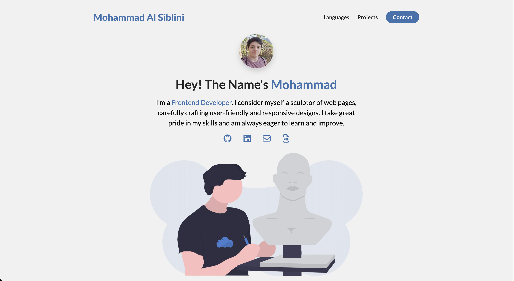

# E-Portfolio

## Description

This project is an e-portfolio aimed at showcasing my skills and projects for recruiting purposes. It utilizes HTML, CSS, and JavaScript to create a visually appealing and functional portfolio website.

## Table of Contents

- [Demo](#demo)
- [Features](#features)
- [Technologies Used](#technologies-used)

## Demo

[Click Here To See The Hosted Site](https://mhmdlsiblini.github.io/E-Portfolio-1/)

Some Screenshots from the Site:

## Features

- Responsive Design with Media Queries
- Smooth Transitions and Simple Animations
- Interactive Project Showcase

## Technologies Used

- HTML
- CSS
- JavaScript
